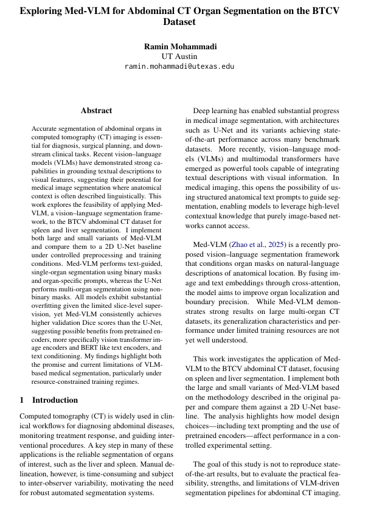

- Performed single-organ CT segmentation (liver, spleen) using a vision–language model with fixed anatomical text 
prompts, achieving Dice score of 0.58 and outperforming a multi-organ 2D U-Net baseline (0.38 Dice)

