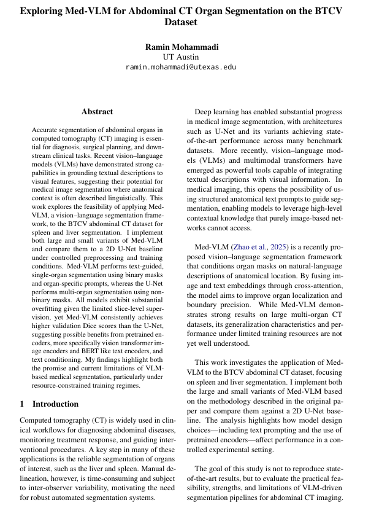

- Exploration of an image segmentation vision language model (Med-VLM) that uses a language description of the organ's anatomical location to ideally enhance the segmentation accuracy on organs. The code for Med-VLM was not provided in their research paper, so I recreated it to the best of my ability on a smaller CT organ dataset and performed segmentation on 2D CT image slices.

